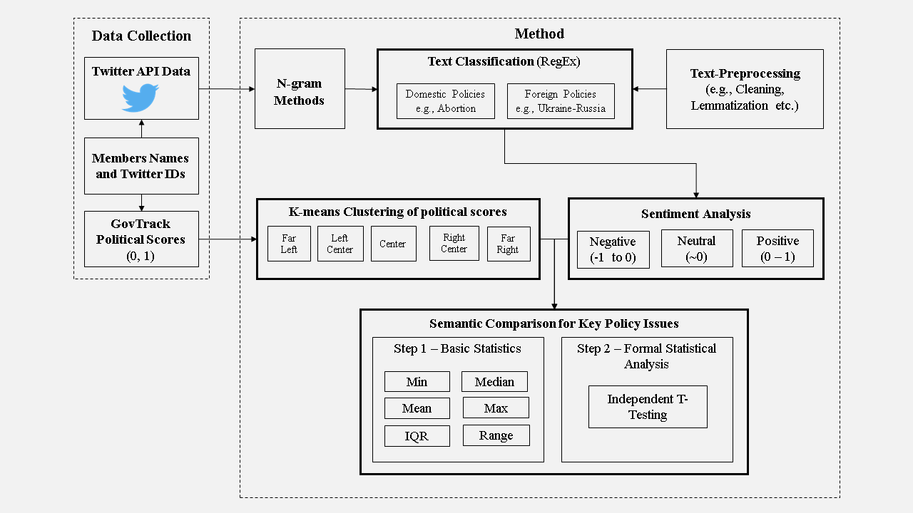
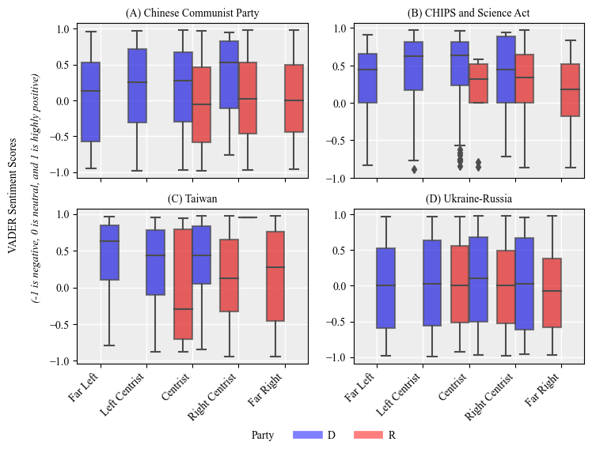
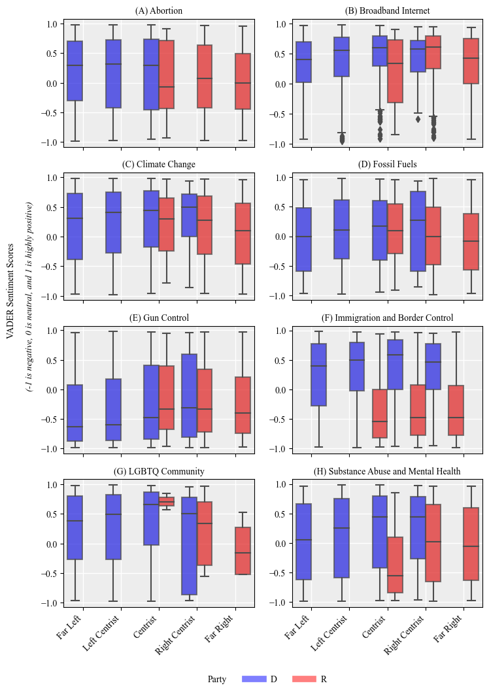
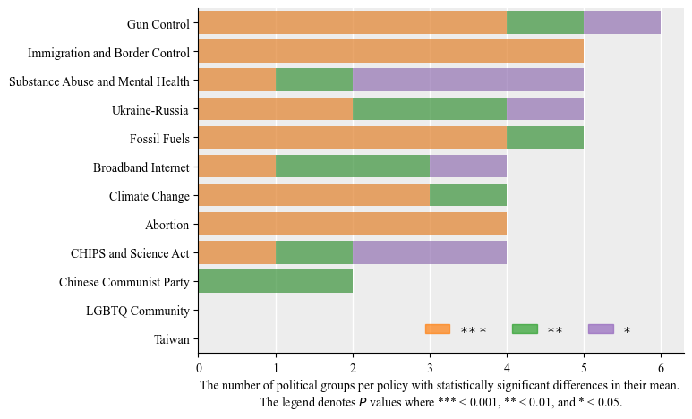

# **Quantifying polarization across political groups on key policy issues using sentiment analysis**
## 1. Data Analysis
There is growing concern over increased political polarization across democratic economies, e.g., in the US., UK, France, Italy, Spain, etc. Unfortunately, this polarization has spurred greater division and intolerance among social groups. 

Taking the US political groups as the benchmark, we apply the code in the notebooks section of this repository to investigate the degree of polarization on key policy. Two sets of policies are analyzed, domestic (e.g., abortion, LGBTQ, etc.) and foreign (e.g., China, Russia., ).

Citation
---------
- Bor, D., Lee, B. S., & Oughton, E. J. (2023). Quantifying polarization across political groups on key policy issues using sentiment analysis (arXiv:2302.07775). arXiv. https://doi.org/10.48550/arXiv.2302.07775

Example Method
-------------

The method utilizes natural language processing tools to compute the sentiment of the tweets from the 115th and 116th congress members. The [Govtrack.us](https://www.govtrack.us/congress/members/report-cards/2020) data provides the scores indicating how politically left or right a member is. Five political groups are derived from the GovTrack political scores ranging from Far Left, Center Left, Centrist, Center Right, and Far Right. The tweets are then grouped into a policy category using a filtering algorithm. Finally, an independent t-test model is applied to test for statistical significance at 95% confidence of the mean sentiments across the political groups in each studied policy. This serves as the basis for polarization ranking.

### Figure 1 Quantifying polarization method overview

  

Example Results
------------

[VADER](https://github.com/cjhutto/vaderSentiment) Python package is applied to compute the sentiment values of the tweets. The sentiments towards the investigated policies by the political groups are reported descriptively in *figure 2* and *figure 3*. The polarization ranking is based on the results from the independent test.

### Figure 2 Key US geopolitical policy themes and associated sentiment scores

  

### Figure 3 Key US domestic policy themes and associated sentiment scores

  

### Figure 4 Ranking of polarization levels

  

Data
------------

Download the Twitter dataset from Zenodo using the link below. Copy the data into the data_analysis folder.
- https://zenodo.org/record/7628481

Generate Results
----------------

Use the data_analysis folder of this repository as the working directory to run the notebooks. The recommended method is using Conda to create and manage the environment and run Jupyter notebooks.

	conda env create -f environment.yml

Start Jupyter lab

## 2. Dashboard